# Design Artifacts

## Overview

The design artifacts document properly details our groups design process throughout the project. It contains all diagrams and other forms of organization and planning that relates to our program architecture.

## Use Case Diagram

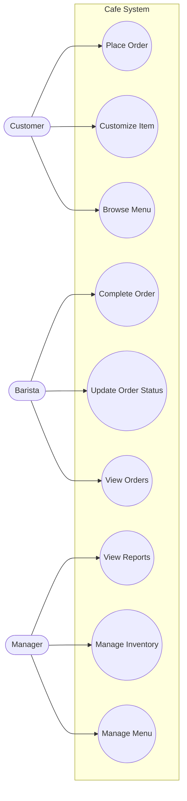

## Wireframes

### Customer Ordering Screen
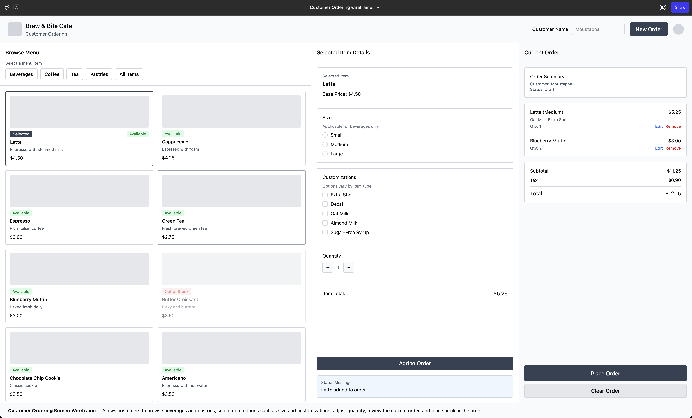

### Barista Fulfillment Screen
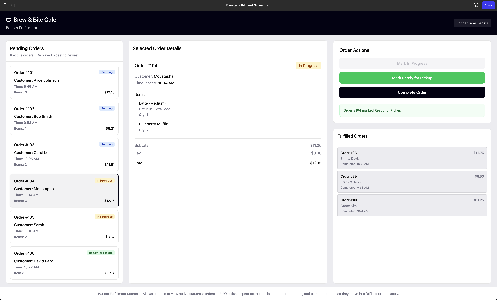

### Manager Inventory Management
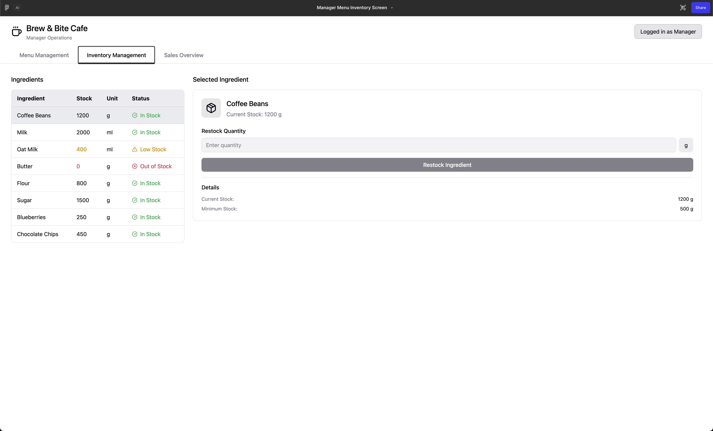

### Manager Menu Management
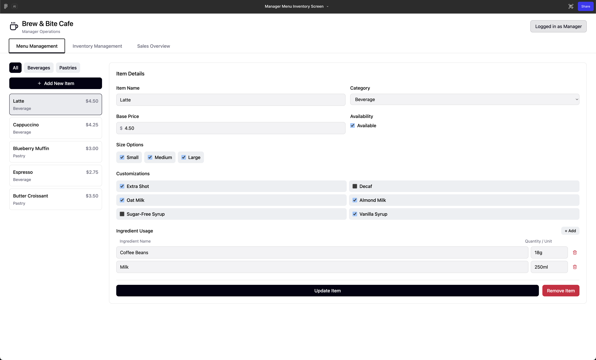

### Manager Sales Overview
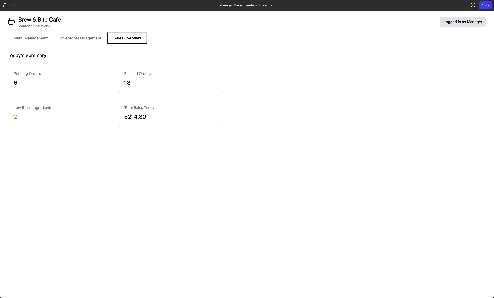

## Conceptual Classes to Software Classes

| Conceptual Class Name | Software Class Name | Included/Merged/Split/Omitted | Why?                                          |
| --- | --- | --- | --- |
| User | User (abstract) | Included | Represents shared attributes for all roles |
| Customer | Customer | Included | Has specific access for customers |
| Barista | Barista | Included | Has specific access for baristas |
| Manager | Manager | Included | Has specific access for managers |
| Menu Item | MenuItem (abstract) | Included | Shares attributes and methods for all menu items |
| Beverage | Beverage | Included | Requires its own beverage logic |
| Pastry | Pastry | Included | Requires its own pastry logic |
| Order | Order | Included | Core business entity |
| OrderItem | OrderItem | Included | Represents quantity of an order |
| Inventory | Inventory | Included | Centralized ingredient tracking |
| InventoryItem | InventoryItem | Included | More implementation-specific |
| Menu | MenuService | Included | Handles business logic separate from data |
| Authentication | AuthService | Added | Needed for login handling |
| Model | BrewBiteSystem | Added | Simplify backend communications, allow flexibility |
| UI | - | Omitted | JavaFX UI elements can talk directly to backend facade |

## High-Level UML Class Diagram

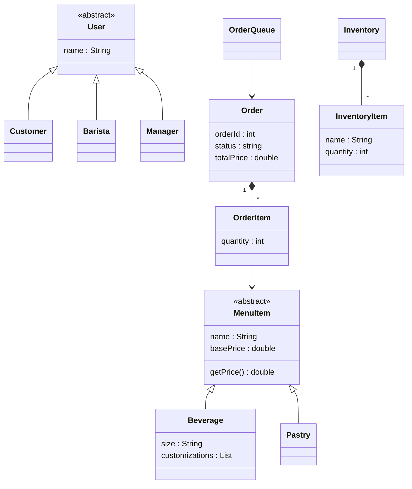

## Delegating Responsibilities

### Sequence 1: Customer Orders Item

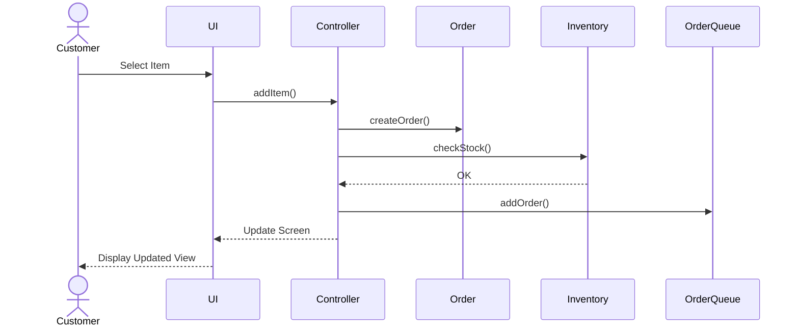

This reflects object-oriented principles and patterns by properly using a facade (Controller) to standardize inputs, and utilizes error checking to make sure stock and order exist.  

### Sequence 2: Barista Fulfills Order

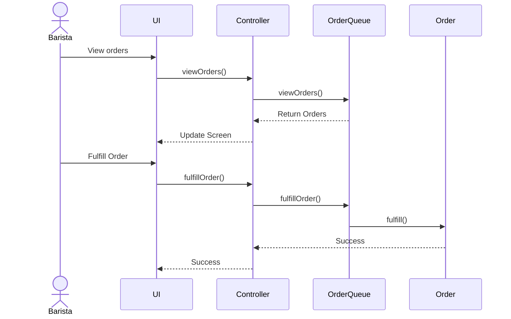

This reflects object-oriented principles and patterns by properly bubbling down events throughout the program and using middlemen such as OrderQueue to guarantee no false fulfillments happen.

### Sequence 3: Manager adds Inventory

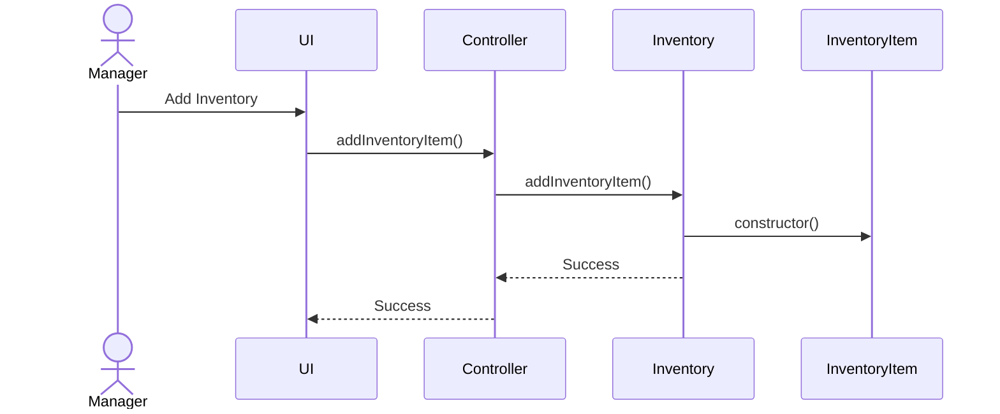

This reflects object-oriented principles and patterns by using the Controller in the MVC architecutre to properly split the frontend (user) with the backend (system). 

## Application Layers & MVC Implementation

The following class UML diagram displays the layers of the MVC implementation along with the class interactions and dataflow using this architecture. 

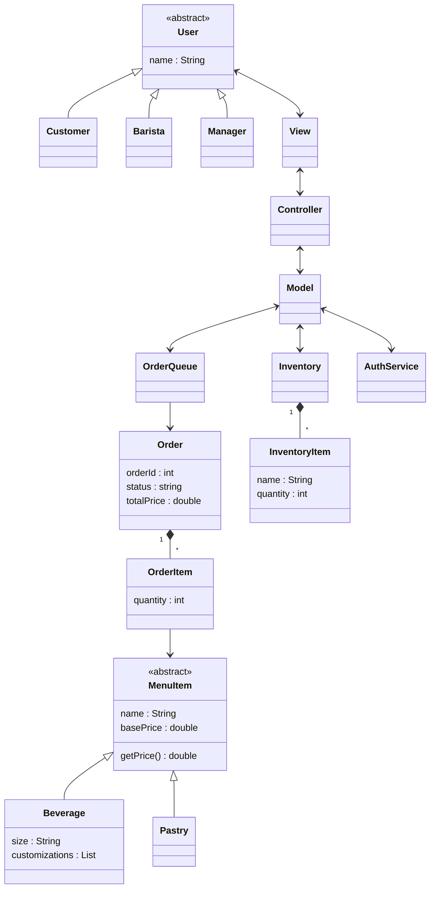

## Applied OO Principles & Patterns

### Principle 1: Observer Pattern (MANDATORY) 

Our program uses the observer pattern in the implemenmtion of the frontend to backend communcation. Because our menu and orders are in a constant state subject to change, the changes prone to happen need to be properly observed and managed to update state of each of these modules. This is much more effective than constantly polling all orders that exist or all items on the menu to check for potential updates.   

### Principle 2: Factory Pattern (MANDATORY)

Our program uses the factory pattern in the implemention of creating item on the menu. The factory pattern is used to manage the fact there are many different types of items on the menu, this is done by having different factories take in the item-specific parameters to then create an instance of the abstract class MenuItem.

### Principle 3: Strategy Pattern

The strategy pattern is used in the different forms of pricing logic based one what Implementation of MenuItem is being called. Beverage and Pastry will run separate logic and yield different results because they are using different strategies.

### Principle 4: Facade Pattern 

The Model / BrewBiteSystem acts as a facade for checking inventory, processing orders, and getting menu information.

### Single Responsibility Principle Explanation

This project adheres to the Single Responsibility Principle by using many different object oriented patterns that reduce coupling and simplifies the code. One example of this is the usage of the MVC structure. Our model view and controller modules all manage data releveant to them and change state only when necessary data from other modules is needed. Splitting these up allows for simpler testing, development, and readability. Our usage of the AuthenticationService Singleton allows for simplciity when it comes to logging in. Because all logins should be treated the same (Certain login credentials shouldn't work in certain places where others wont), this singleton allows for classes to have easy access to the AuthenticationService.  